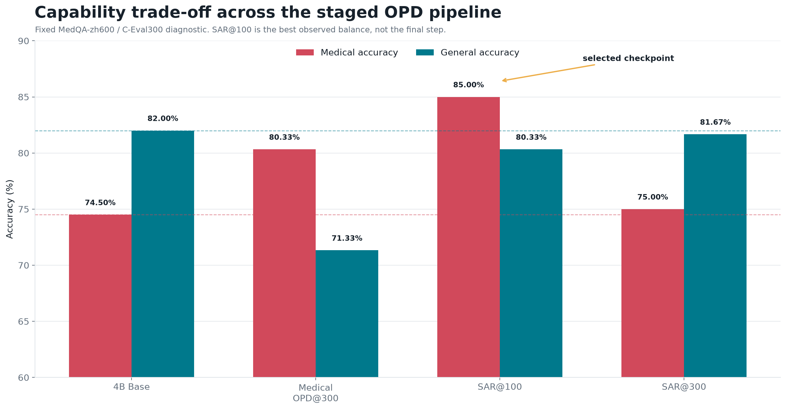
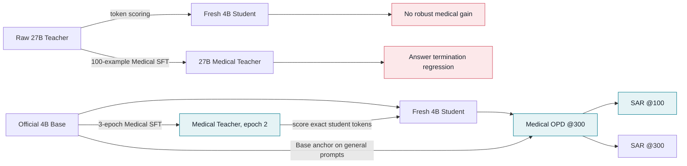
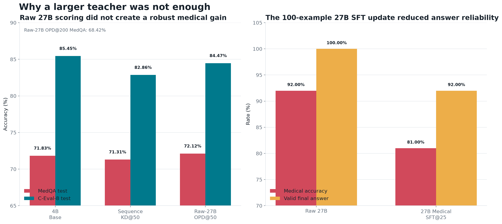
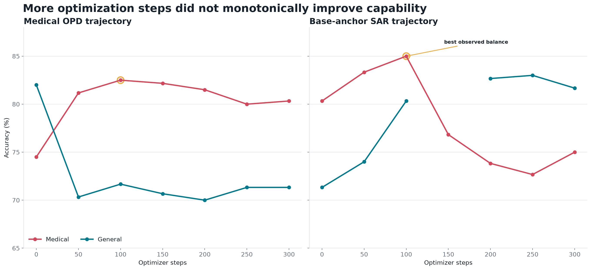
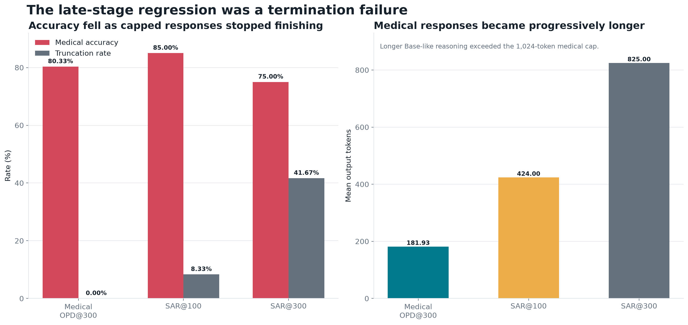

<div align="center">

# MedDistill-OPD

### 医疗领域 On-Policy Distillation 与通用能力恢复

从“更大的 Teacher 为什么没有教好 4B”出发，沿着失败证据构建
**Medical SFT → Medical OPD → Base-anchor SAR** 的可审计实验链路。

[](https://github.com/DON738110198/meddistill-opd/actions/workflows/ci.yml)


[](LICENSE)

</div>



## 研究问题

医疗 SFT 可以迅速改变模型的领域输出，但往往以通用能力为代价。一个自然想法是换用更大的
27B Teacher，让 4B Student 在自己的回答轨迹上接受逐 token 指导。本项目没有把这个想法当成
结论，而是依次回答四个更小的问题：

1. **更大的 raw 27B Teacher 是否足以带来医疗增益？**
2. **如果不够，给 27B 做少量 Medical SFT 是否能形成更好的领域 Teacher？**
3. **同尺度的 4B Medical-SFT Teacher 是否更匹配 4B Student 的 on-policy rollout？**
4. **Medical OPD 损失的通用能力，能否再由原始 Base Teacher 拉回来？**

最终最有价值的结论不是“OPD 一定涨分”，而是：

> **Teacher 更大、直接答题更准，并不保证它在 Student 的真实轨迹上提供有效的 token-level
> 监督。领域分布、推理长度与答案终止行为同样决定蒸馏是否成功。**

## 方法概览



### OPD 在训练什么

每一步都由当前 Student 采样自己的 completion。Teacher 不重新生成答案，而是对完全相同的
`prompt + student completion` 计算 token log-probability：

$$
r_t^{KL}=\log \pi_\theta(y_t\mid x,y_{1:t-1})-\log \pi_T(y_t\mid x,y_{1:t-1}),
\qquad A_t=-\beta r_t^{KL}.
$$

实现中只更新 completion token，并显式校验：

- Student token 与 Student logprob 一一对应；
- Teacher 对同一组 token ID 打分；
- prompt mask 为 0，completion mask 为 1；
- loss、reverse KL 与 trainer token count 全部有限且一致；
- optimizer state 与 sampler weights 成对保存，支持断点恢复。

## 实验链路

### 1. 先验证 raw 27B → 4B

raw 27B 没有经过医疗领域适配。在完整官方测试上，50-step OPD 对 MedQA 的变化仅为
`71.83% → 72.12%`，C-Eval-8 反而由 `85.45%` 降至 `84.47%`；继续到 200 steps 后，
MedQA 下降至 `68.42%`。

逐题诊断显示，M0-only 的 390 个正确样本中有 386 个在 OPD@200 上未能在输出上限前完成回答。
双方都正常结束时准确率相同。因此这里观察到的主要是**答案终止退化**，不能包装成医疗知识变化。



### 2. 再验证 27B 是否缺少领域适配

对 27B 做 rank-32 LoRA Medical SFT，按 `1/10/25` steps 保存；step 25 共呈现 100 个
Medical-O1 训练样本。随后在独立的 MedQA-dev100 上评测：

| Teacher | 医疗准确率 | 最终答案有效率 | 平均输出 tokens |
|---|---:|---:|---:|
| raw 27B | 92/100 | 100% | 881.05 |
| 27B Medical SFT@25 | 81/100 | 92% | 451.47 |

8 个无效回答都在截断后没有提交可解析选项。只看格式有效的 92 题，raw/SFT 为 `84/92` 与
`81/92`，不足以证明医疗知识显著下降；能够确认的是，这个**小数据、高学习率、开放式输出**的
配方损害了受限长度下的答案终止可靠性，因此没有继续将该 checkpoint 用作 OPD Teacher。

### 3. 构建同尺度 Medical Teacher

随后对官方 4B 进行完整三轮 Medical SFT。训练语料来自 Medical-O1 中文子集，经过精确与近重复
过滤后，由 20,171 条保留 17,105 条，并隔离 MedQA dev/test 重合项。

| Checkpoint | 医疗筛选集 | 通用筛选集 |
|---|---:|---:|
| 4B Base | 74 | 79 |
| SFT epoch 1 | 77 | 63 |
| **SFT epoch 2** | **82** | **64** |
| SFT epoch 3 | 78 | 61 |

epoch 2 是观察完整轨迹后选出的探索性 Teacher，不被描述成预注册最优点。它说明 Medical SFT
确实建立了领域输出策略，同时也暴露了明显的通用遗忘。

### 4. Medical OPD：从 fresh 4B 学领域行为

Medical OPD 不从 SFT 权重继续训练，而是创建 fresh 4B Student。Student 对医疗问题采样
`group_size=4` 条轨迹，冻结的 epoch-2 Teacher 对这些轨迹逐 token 打分。



在固定 MedQA-zh600/C-Eval300 诊断上，Medical OPD@100 达到最高医疗准确率 `82.50%`；
继续训练到 step 300 后为 `80.33%/71.33%`。reverse KL 持续下降，但下游准确率没有继续提高，
说明**训练目标变好不等于应用指标变好**。

### 5. Base-anchor SAR：恢复通用能力

SAR 从完整的 Medical OPD@300 Student 与 optimizer state 继续：

1. Student 保持为 Medical OPD 权重；
2. Teacher 切换成未做 Medical SFT 的官方 4B Base；
3. 训练 prompt 切换为通用选择题，只使用题目与选项，不把标签作为训练信号；
4. Student 仍先生成自己的轨迹，Base Teacher 再进行逐 token 打分；
5. 每 50 steps 固定评测一次医疗与通用能力。

| Checkpoint | MedQA-zh600 | C-Eval300 | 医疗截断率 |
|---|---:|---:|---:|
| Medical OPD@300 | 80.33% | 71.33% | 0.00% |
| SAR@50 | 83.33% | 74.00% | 5.33% |
| **SAR@100** | **85.00%** | **80.33%** | **8.33%** |
| SAR@200 | 73.83% | 82.67% | 40.50% |
| SAR@250 | 72.67% | **83.00%** | 40.00% |
| SAR@300 | 75.00% | 81.67% | 41.67% |

SAR@100 是观察到的最佳折中点。继续训练会让 Student 越来越接近 Base 的长推理分布：医疗回答
平均长度从 424 增至 825 tokens，截断率从 `8.33%` 升至 `41.67%`。较短的 MedQA 输出上限
无法容纳这种行为，而 C-Eval 的较长输出上限仍允许模型提交答案，于是形成“通用回升、医疗下降”
的分叉曲线。



## 结果边界

本项目区分三种评测口径，避免把诊断集与正式测试混为一谈：

| 口径 | 用途 | 样本数 | 可支持的结论 |
|---|---|---:|---|
| MedQA test + C-Eval-8 test | raw-27B、Sequence KD 与 Base 的完整比较 | 3,426 + 1,925 | 正式完整测试 |
| 固定 MedQA-zh600/C-Eval300 | 跟踪 Medical OPD 与 SAR 训练轨迹 | 600 + 300 | 协议内诊断，不是 untouched official test |
| MedQA-dev100/C-Eval-val100 | 选择 Teacher 与早期 checkpoint | 100 + 100 | 筛选信号，不是最终效果 |

必须保留的限制：

- SAR@100 是观察曲线后选择的最佳折中，不是预注册终点；
- Medical OPD 的端到端收益很大一部分来自更短、更稳定地提交答案；
- 27B Medical SFT 的下降不能直接解释为医疗知识被训练坏；
- 固定 C-Eval300 与训练池在自定义切分内 row-disjoint，但不等同于官方 untouched test；
- 本仓库不发布原始题目、预测文本、checkpoint URI 或任何凭据。

## 数据治理

| 数据 | 用途 | 公开策略 |
|---|---|---|
| Medical-O1 中文子集 | Medical SFT / OPD prompt | 仅记录版本与过滤统计，不提交原文 |
| MedQA 中文四选一 | 医疗评测 | 仅提交聚合指标与哈希 |
| C-Eval 非医疗科目 | 通用评测 / Base-anchor prompt | 训练时去标签，仓库不提交题目 |
| Alpaca-ZH | Mixed SFT 与历史通用 replay | 仅记录版本，不提交原文 |

数据下载后会执行规范化、精确去重、近重复隔离、split/ID 交集检查与长度分布统计。所有原始数据、
处理后语料、预测缓存和远程运行状态均由 `.gitignore` 排除。

## 快速开始

### 环境

- Python 3.13
- [uv](https://docs.astral.sh/uv/)
- 已登录的 PyTRIO workspace；凭据只保存在 `~/.pytrio`，不要写入环境文件或仓库

```powershell
uv sync --all-extras
uv run medical-opd preflight
uv run pytest -q
uv run ruff check src tests tools
```

### 准备数据

```powershell
uv run medical-opd prepare-data --shared-cache ..\.cache\huggingface
uv run medical-opd prepare-medical-sft-data --shared-cache ..\.cache\huggingface
uv run medical-opd prepare-diagnostic-data --shared-cache ..\.cache\huggingface
```

### 分阶段训练

所有远程训练命令都必须显式加入 `--confirm-paid`。建议先运行 plan，再按 `1 → 10 → 正式阶段`
扩展，并在每个阶段核对 token、loss、mask 与 checkpoint。

```powershell
# Medical SFT Teacher
uv run medical-opd plan-medical-sft --steps 1 --output-dir runs\staged\medical-sft
uv run medical-opd medical-sft --steps 1 --output-dir runs\staged\medical-sft --confirm-paid

# Medical OPD。Teacher 路径与本地状态必须来自上一步保存的 checkpoint。
uv run medical-opd plan-staged-opd --stage medical --steps 25 `
  --output-dir runs\staged\medical-opd `
  --teacher-model-path "trio://sampler_weights/..." `
  --teacher-gate reports\generated\medical_teacher.json
```

### 重绘图表

所有 README 图表都从一个可审计的指标快照生成：

```powershell
uv run --extra viz python tools\plot_results.py
```

数据文件位于 [`results/final_metrics.json`](results/final_metrics.json)，绘图脚本位于
[`tools/plot_results.py`](tools/plot_results.py)。

## 工程设计

- **Paid-run guard**：远程训练与评测必须显式确认，plan 阶段不创建 PyTRIO client。
- **Exact token contract**：Teacher 必须评分 Student 实际生成的 token ID，不允许重新编码另一条答案。
- **Explicit mask**：completion mask 独立保存，不使用 `advantage != 0` 代替有效 token。
- **Resume integrity**：恢复前校验 method、seed、data/config hash、cursor、optimizer state 与 sampler。
- **Cache discipline**：Teacher generation、预处理、评测预测均可恢复，避免重复请求。
- **Leakage checks**：训练与评测按 split、ID、规范化文本及近重复阈值多层隔离。
- **Negative-result retention**：raw 27B、27B SFT 与长程 SAR 的失败 checkpoint 均保留为机制证据。

## 仓库结构

```text
configs/                    实验与训练契约
src/medical_opd/            数据、OPD/SAR、评测、恢复与分析实现
tests/                      token 对齐、mask、resume、数据泄漏与付费保护测试
results/final_metrics.json  公开聚合指标快照
tools/plot_results.py       可重复生成全部结果图
docs/assets/                README 图表
reports/RESULTS.md          精简的公开结果与限制
```

## 引用与致谢

OPD 的方法背景来自 Generalized Knowledge Distillation 与 MiniLLM 中关于 student-generated
sequences 和 reverse KL 的研究。代码来源、独立实现范围与数据许可证边界统一记录在
[`NOTICE.md`](NOTICE.md)，不在结果叙事中混入复现来源或未验证的外部指标。

## License

代码以 [Apache License 2.0](LICENSE) 发布。数据集与模型各自遵循其原始许可证；本仓库的代码
许可证不授予任何数据或模型权利。
